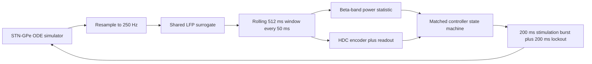
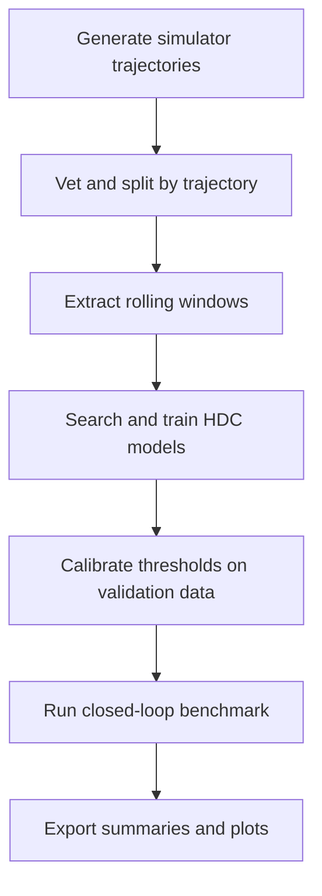

# HDC-aDBS

*Hyperdimensional-computing adaptive deep brain stimulation testbed for Parkinsonian STN-GPe simulation.*

**Authors:** Thomson Lam and Oliver Olejar

HDC-aDBS is an in silico research prototype for studying whether a lightweight hyperdimensional-computing detector can act as an adaptive deep brain stimulation trigger under the same conditions as a classical beta-threshold controller.

This repository is not a clinical system. It is a simulation-driven benchmark and experimentation project designed to compare controller logic fairly, explain the tradeoffs clearly, and make the current findings easy to inspect.

## Why This Matters

In Parkinson's disease, the basal ganglia can become locked into abnormal beta-band oscillations, roughly `13-30 Hz`. In practice, one goal of adaptive deep brain stimulation, or `aDBS`, is to stimulate only when the brain appears to be entering or staying in that pathological state, rather than stimulating continuously.

This project models that idea in a controlled setting. It simulates the interaction between the subthalamic nucleus, `STN`, and the globus pallidus externa, `GPe`, then turns the simulator output into an `LFP surrogate`: a simplified signal that stands in for the kind of neural signal a controller could monitor.

From there, the project asks a simple question with a non-trivial engineering answer: can a lightweight HDC-based detector be competitive with a classical beta-power trigger when both use the same signal, timing, stimulation rules, and evaluation setup?

## Project Goal

The goal of HDC-aDBS is not to prove that HDC is universally better. The goal is to build a fair benchmark that compares two decision statistics under one locked experimental contract:

- `beta_adbs`: stimulate when causal beta activity crosses a threshold
- `hdc_adbs`: stimulate when the recent signal pattern looks more pathological than healthy in HDC space

That comparison is run against the same shared references:

- `no_stimulation`
- `continuous_dbs`

## How the System Works

At a high level, the simulator produces neural activity, the project converts it into one controller-visible signal, and both controllers operate on that same signal stream.



The experiment itself is also staged so that offline model selection happens before final benchmark reporting.



### What gets compared?

| Condition | What it means |
| --- | --- |
| `no_stimulation` | Pathological run with no intervention |
| `continuous_dbs` | Stimulation is always on |
| `beta_adbs` | Adaptive controller triggered by beta-band power |
| `hdc_adbs` | Adaptive controller triggered by HDC similarity margin |

The important fairness rule is that both adaptive controllers see the same resampled signal, use the same `512 ms` windows, make decisions every `50 ms`, and apply the same stimulation burst and lockout timing.

## HDC in Plain English

Hyperdimensional computing, `HDC`, turns short signal windows into high-dimensional binary or bipolar patterns called hypervectors. Instead of hand-checking one feature at a time, the controller compares whether the current window looks more like a stored healthy pattern or a stored pathological pattern.

In this project, that matters because HDC can be efficient at inference time while still capturing richer temporal structure than a single beta-power threshold. The project therefore treats HDC as a candidate lightweight controller signal, not as a guaranteed improvement.

## Current Findings

The project already has a full offline-to-closed-loop pipeline, and the current artifacts are useful because they show what worked, what did not, and where the next iteration should go.

### What the project has already demonstrated

- The simulator can generate more than just clean healthy and clean pathological extremes.
- The dataset pipeline includes transition-focused subsets such as `onset`, `recovery`, and `moderate`, which makes evaluation more realistic than training only on easy end states.
- The HDC search pipeline explored `24` encoder configurations across dimension, binning, initialization, and readout choices.
- The project compared prototype-style bundled hypervectors against linear or logistic-style classification over hypervectors.

### What the current frozen artifacts say

The checked-in frozen outputs come from:

- `artifacts/encoder_search/freeze_record.yaml`
- `artifacts/models/train_report.yaml`
- `artifacts/closed_loop/summary.yaml`

| Finding | Current snapshot |
| --- | --- |
| Frozen encoder | `D=10000`, `n_bins=8`, `value_init=random` |
| Frozen readout | `prototype` |
| Selection outcome | Fallback winner because no candidate passed all guardrails |
| Validation clean prototype score | `balanced_accuracy=0.631`, `auroc=0.721` |
| Held-out clean prototype test score | `balanced_accuracy=0.548`, `auroc=0.679` |
| Recovery robustness | Weak, with validation recovery AUROC currently `0.194` |
| Healthy specificity | Still weak, with high false-trigger behavior in stored benchmark runs |

The benchmark is therefore best understood as a strong systems milestone rather than a final performance result. It shows that the project can:

- build synthetic trajectories from the simulator
- convert them into a reproducible dataset
- search and freeze HDC detector settings
- run matched closed-loop comparisons
- report quality, efficiency, and specificity metrics

At the same time, the current numbers make it clear that the frozen controller settings are not yet where they need to be.

### Closed-loop snapshot

| Condition | Mean beta power | Pathological occupancy | Mean decision time per window (ms) |
| --- | ---: | ---: | ---: |
| `no_stimulation` | `7.294` | `0.500` | `0.000` |
| `continuous_dbs` | `8.363` | `0.649` | `0.000` |
| `beta_adbs` | `8.292` | `0.651` | `0.003` |
| `hdc_adbs` | `8.019` | `0.526` | `0.694` |

Healthy-run specificity is still a major open issue in the stored benchmark:

- `beta_adbs` healthy false-trigger rate: `120.19` stim events per minute
- `hdc_adbs` healthy false-trigger rate: `91.35` stim events per minute

## Next Steps

The slide deck and the checked-in artifacts point in the same direction: the project now needs stronger learning and controller refinement, not just more infrastructure.

- Improve learning over hypervectors instead of relying only on raw window encoding and simple prototype comparison.
- Replace the current manual-style grid search with stronger encoder optimization so better HDC settings can be discovered more efficiently.
- Continue exploring linear classification over hypervectors where it improves fit while preserving efficient inference.
- Complete a stronger full-condition closed-loop comparison after better thresholding and detector settings are frozen.
- Reduce false triggers in healthy runs and improve recovery behavior before making stronger claims about adaptive control quality.

## Quickstart

If you want to reproduce the current pipeline from the repository root:

```bash
uv sync
uv run python train/build-static-dataset.py
uv run python train/prepare-static-splits.py
uv run python train/valid-train.py
uv run python -m controllers.run_closedloop_benchmark
uv run python plots/generate_all.py
```

Main outputs land in:

- `artifacts/datasets/static_v1/`
- `artifacts/encoder_search/`
- `artifacts/models/`
- `artifacts/closed_loop/`
- `artifacts/plots/`

For the step-by-step command guide and testing commands, see [docs/usage.md](docs/usage.md).

## Repository Layout

- `configs/`: simulator defaults and experiment settings
- `src/`: simulation and dataset pipeline
- `hdc/`: hypervector encoding, readouts, training, and search
- `controllers/`: beta and HDC adaptive controllers plus benchmark harness
- `train/`: dataset build, split, training, and calibration entrypoints
- `plots/`: plot-generation scripts
- `artifacts/`: generated datasets, model artifacts, summaries, and figures
- `tests/`: simulation, data, HDC, and controller tests
- `docs/`: technical reference docs

## Further Reading

- [docs/experiment-spec.md](docs/experiment-spec.md)
- [docs/usage.md](docs/usage.md)
- [docs/ode-test.md](docs/ode-test.md)
- [docs/hdc.md](docs/hdc.md)
- [docs/models.md](docs/models.md)

